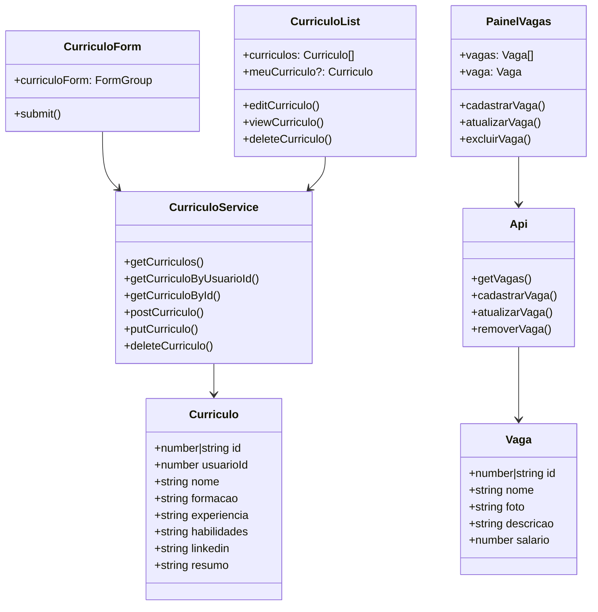
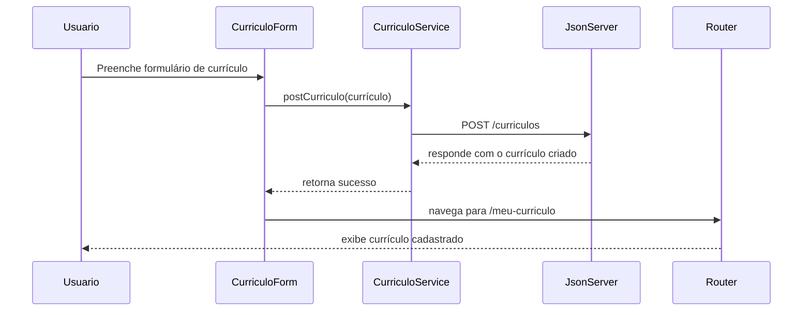

# Especificação de Requisitos de Software (SRS)
**Projeto** Plataforma RH
**Versão** 1.0
**Data** 02/06/2026

## 1. Introdução
### 1.1 Propósito
Este documento descreve os requisitos funcionais e não funcionais do módulo de Currículos e Vagas da Plataforma RH. O objetivo é permitir o gerenciamento completo de currículos por candidatos e o controle de vagas pela administração, usando uma interface Angular integrada a um backend simulado.

### 1.2 Escopo
O sistema abrange:
- Frontend Angular standalone com rotas e componentes para currículos e vagas.
- Mock backend com `json-server` para persistência de dados em `backend/db.json`.
- CRUD completo de currículos e cadastro/edição de vagas.
- Aplicação de estilo dark theme para uma interface moderna e profissional.

---

## 2. Descrição Geral
O módulo possui duas grandes áreas funcionais:
- Gestão de currículos: cadastro, listagem, edição, exclusão e visualização detalhada.
- Gestão de vagas: painel administrativo para criar, editar, excluir e listar vagas.

A aplicação usa rotas Angular para separar as responsabilidades e tornar a navegação simples.

## 3. Requisitos do Sistema
### 3.1 Requisitos Funcionais (RF)
- RF01: O usuário deve poder listar todos os currículos registrados.
- RF02: O usuário deve poder criar um novo currículo.
- RF03: O usuário deve poder editar um currículo existente.
- RF04: O usuário deve poder excluir um currículo.
- RF05: O usuário deve poder visualizar os detalhes de um currículo.
- RF06: O usuário deve poder listar todas as vagas disponíveis.
- RF07: O usuário deve poder cadastrar uma nova vaga.
- RF08: O usuário deve poder atualizar os dados de uma vaga.
- RF09: O usuário deve poder excluir uma vaga.

### 3.2 Requisitos Não-Funcionais (RNF)
- RNF01: A interface deve ser responsiva e funcionar em desktop e mobile.
- RNF02: O backend simulado deve ser inicializado localmente com `json-server`.
- RNF03: A aplicação deve exibir feedback imediato ao usuário em operações de sucesso ou erro.
- RNF04: O código deve compilar sem erros TypeScript e Angular.

## 4. Interface de Dados e Modelagem do Sistema
O projeto usa os seguintes recursos de dados:
- `curriculos`: coleção de currículos armazenada em `backend/db.json`.
- `vagas`: coleção de vagas armazenada em `backend/db.json`.

### 4.1 Modelos principais
- `Curriculo` (`src/app/model/curriculo.model.ts`): id, usuarioId, nome, formacao, experiencia, habilidades, linkedin, resumo.
- `Vaga` (`src/app/model/vaga.model.ts`): id, nome, foto, descricao, salario.

### 4.1.1 Diagrama de Uso
```mermaid

usecaseDiagram
    actor Usuario
    actor RH

    Usuario --> (Visualizar currículos)
    Usuario --> (Cadastrar currículo)
    Usuario --> (Editar currículo)
    Usuario --> (Excluir currículo)
    Usuario --> (Visualizar detalhes do currículo)

    RH --> (Visualizar vagas)
    RH --> (Cadastrar vaga)
    RH --> (Editar vaga)
    RH --> (Excluir vaga)
    RH --> (Acessar painel de vagas)
```

### 4.1.2 Diagrama de Classe


### 4.1.3 Diagrama de Fluxo


### 4.2 Endpoints do mock backend
- `GET /curriculos`
- `GET /curriculos/:id`
- `POST /curriculos`
- `PUT /curriculos/:id`
- `DELETE /curriculos/:id`
- `GET /vagas`
- `POST /vagas`
- `PUT /vagas/:id`
- `DELETE /vagas/:id`

## 5. Critérios de Aceitação
1. **Operação CRUD:** Deve ser possível criar, ler, atualizar e excluir currículos e vagas com o backend local.
2. **Navegação:** Todas as rotas devem carregar o componente correto sem erros de console.
3. **Feedback:** O usuário deve receber alertas ou mensagens claras após salvar, atualizar ou excluir dados.
4. **Consistência:** Os dados exibidos na interface devem corresponder ao conteúdo do backend simulado (`backend/db.json`).
5. **Compilação:** O comando `npm run build` deve completar com sucesso.

## 6. Configuração do Ambiente
### Requisitos
- Node.js 18+ instalado.
- npm disponível no sistema.

### Instalação
1. Navegue até a pasta do projeto:
   ```bash
   cd frontend/Frameworks/Angular/sa-rh-completo
   ```
2. Instale as dependências:
   ```bash
   npm install
   ```

### Servidores
O projeto usa um mock backend com `json-server` em `localhost:3007` e frontend Angular em `localhost:4200` (ou porta alternativa quando 4200 estiver em uso).

## 7. Como executar o projeto
### Usando frontend e backend separadamente
1. Inicie o backend:
   ```bash
   npm run backend
   ```
2. Em outro terminal, inicie o frontend:
   ```bash
   npm start
   ```
3. Abra o navegador em:
   ```bash
   http://localhost:4200
   ```

### Iniciando os dois juntos
1. Execute:
   ```bash
   npm run start:full
   ```
2. O frontend ficará disponível em `http://localhost:4200` ou na porta alternativa informada.

## 8. Rotas principais do módulo de currículos
- `/curriculos` — Lista geral de currículos cadastrados e acesso ao currículo do usuário.
- `/curriculos/novo` — Formulário para cadastrar um novo currículo.
- `/curriculos/editar/:id` — Formulário para editar um currículo existente.
- `/curriculos/:id` — Visualização detalhada de um currículo.
- `/meu-curriculo` — Visualização do currículo do usuário simulado.

## 9. Rotas principais do módulo de vagas
- `/vagas` — Lista pública de vagas disponíveis.
- `/painel-vagas` — Painel administrativo para cadastrar, editar, excluir e listar vagas.

## 10. Observações 
- O backend simulado usa `curriculos` e `vagas` em `backend/db.json`.
- O serviço Angular de currículos está em `src/app/core/services/curriculo.service.ts`.
- O serviço de vagas está em `src/app/service/api.ts`.
- O formulário de currículo utiliza `ReactiveFormsModule` e validação básica de campos.
- As operações de cadastro e edição de vaga usam `ngModel` no componente `PainelVagas`.
- O comando `npm run build` já foi validado e compila com sucesso.

