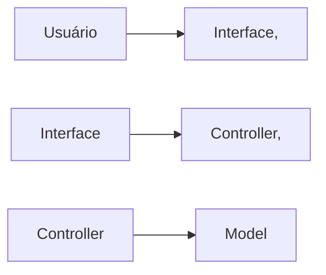
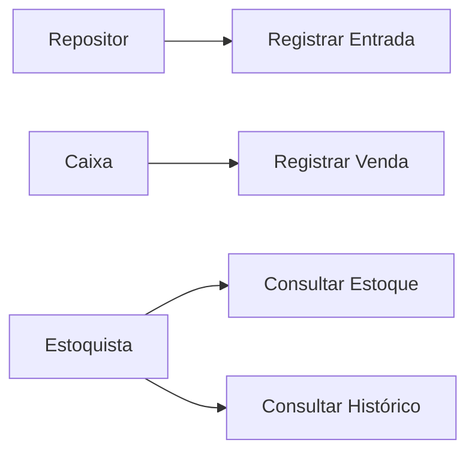
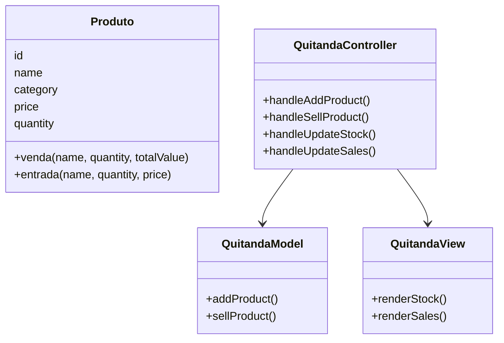
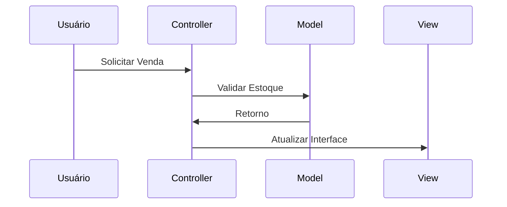
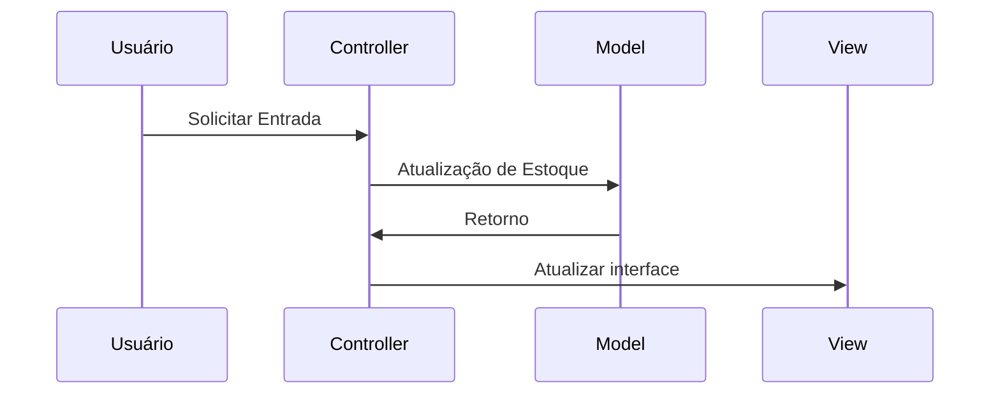
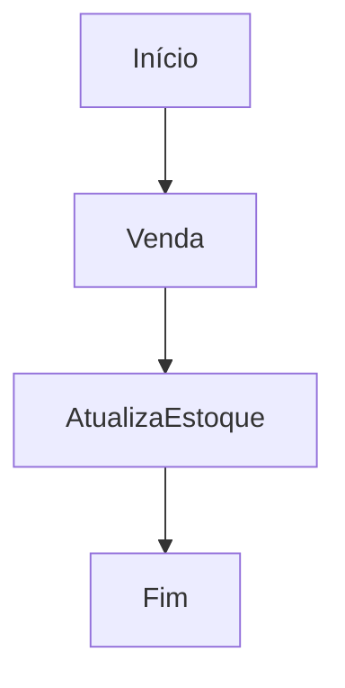
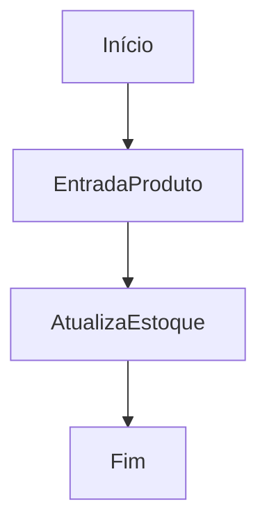
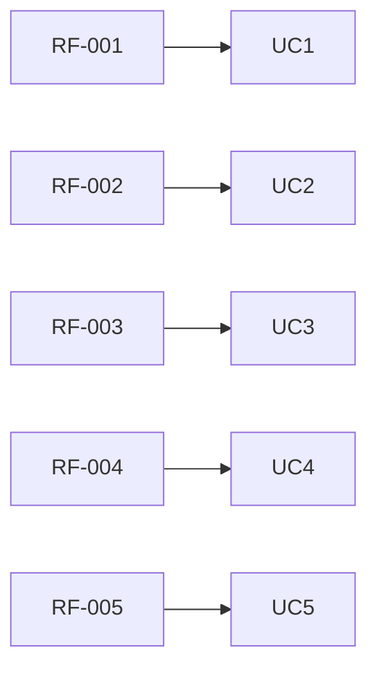

# Documentação de Especificações de Requisitos de Software (SRS)
Documento baseado no SIO/IEEE 29148:2018

## Sistema de Controle de Quitanda (Quitanda MVC)

**Padrão:** ISO/TEC/IEEE 29148:2018

**Versão:** 1.0.0

**Data:** 2026-04-14

**Autor:** Davi Martins

---

## 1. Introdução

### 1.1 Próposito

Este documento descreve os requisitos do sistema **Quitanda MVC**, com objetivo de: 
* Definir funcionalidade
* Padronizar entendimento entre stakeholders
* Servir como base para desenvolvimento e testes

--- 

### 1.2 Escopo

O sistema permitirá:

* Registro de entrada de produto
* Registro de vendas 
* Controle de estoque
* Histórico de movimentações

O Sistema será uma aplicação web frontend utilizando:

* HTML
* CSS
* JavaScript
* Arquitetura MVC
* Estrutura POO

---

### 1.3 Definições

| Termo | Definições |
| ----- | ---------- |
| Produto | Item Comercializado na Quitada |
| Entrada | Registro de Chegada do Produto | 
| Venda | Registro de Saída do Produto |
| Estoque | Quantidade Disponível de Produtos |

####  Acrônimos

* **SGQ** - Sistema de Gestão de Quitanda
* **RF** - Requsito não Funcional
* **RNF** - Requisito Não-Funcional

---

### 1.4 Visão Geral do Documento

Este documento esta organizado em

* Introdução e visão geral
* Descrição do sistema
* Requisitos detalhados
* Modelos UML
* Regras de negócio

---

## 2. Descrição Geral do Sistema

### 2.1 Perspectiva do Sistema

O sistema é standalone (frontend), operado em navegador.

---                  

### 2.2 Funções do Sistema

O sistema deve:

* Cadastrar produtos
* Atualizar estoque 
* Registrar vendas
* Validar operações
* Exibir dados

---

### 2.3 Classes de Usuários

| Usuários | Descrição | 
| -------- | --------- |
| Estoquista | Gerenciar Estoque |
| Caixa | Realizar Vendas |
| Repositor | Registra Entradas |

---

### 2.4 Ambiente Operacional

* Navegador Web (Chrome, Edge, Firefox, OperaGX)

---

### 2.5 Restrições

* Não utilizar Banco de Dados 
* Dados Armazenados na Memória
* Sem autenticação de Usuário

---

### 2.6 Suposições

* Usuário possui conheimento básicos de informática
* Volume de Dados Pequeno

---

## 3. Requisitos do Sistema

### 3.1 Requisitos Funcionais

---

#### RF-001: Cadastro de Produto
**Descrição:** Permitir  cadastrar um produto.

- **Prioridade:** Alta
- **Versão:** 1.0
- **Data:** 2026-04-14
- **Rastreabilidade:** Necessidade do Stakeholder 001

**Critérios de Aceitação:**
- [ ] Entrada de Dados: Nome, Categoria, Preço, Quantidade
- [ ] Validação de Campos
- [ ] Verificação de Duplicidade
- [ ] Saída: Notificações ao Usuário

---

#### RF-002: Atualizar Estoque
**Descrição:** Permitir  atualização de dados de itens existentes.

- **Prioridade:** Alta
- **Versão:** 1.0
- **Data:** 2026-04-14
- **Rastreabilidade:** Necessidade do Stakeholder 002

**Critérios de Aceitação:**
- [ ] Verificar se o item já está cadastrado
- [ ] Entrada de Dados: Nome, Categoria, Preço, Quantidade
- [ ] Validação de Campos
- [ ] Saída: Notificações ao Usuário

---

#### RF-003: Listagem de Estoque
**Descrição:** Exibir informações dos produtos cadastrados.

- **Prioridade:** Alta
- **Versão:** 1.0
- **Data:** 2026-04-14
- **Rastreabilidade:** Necessidade do Stakeholder 003

**Critérios de Aceitação:**
- [ ] Listagem dos Produtos
- [ ] Saída: Nome, Categoria, Preço, Quantidade

---

#### RF-004: Registro de Vendas
**Descrição:** Permitir vender produtos.

- **Prioridade:** Alta
- **Versão:** 1.0
- **Data:** 2026-04-14
- **Rastreabilidade:** Necessidade do Stakeholder 004

**Critérios de Aceitação:**
- [ ] Venda de Produtos Cadastrados
- [ ] Verificação de Quantidade
- [ ] Atualização do Estoque
- [ ] Notificação de Venda Realizada

--- 

#### RF-005: Histórico de Movimentações
**Descrição:** Permitir o registro de movimentações (Entrada e Saída) de produtos.

- **Prioridade:** Alta
- **Versão:** 1.0
- **Data:** 2026-04-14
- **Rastreabilidade:** Necessidade do Stakeholder 005

**Critérios de Aceitação:**
- [ ] Registro das Movimentações em uma Lista
- [ ] Consulta das Movimentações
- [ ] Verificação de Duplicidade
- [ ] Saída: Notificações ao Usuário

---

### 3.2 Requisitos Não-Funcionais

---

#### RNF-001: Usabilidade
**Descrição:** Interface simples e intuitiva.

---

#### RNF-002: Desempenho
**Descrição:** Respostas rápidas e inferiores a 1 segundo.

---

#### RNF-003: Arquitetura MVC
**Descrição:** Estruturação da arquitetura do código em MVC.

---

#### RNF-004: Confiabilidade
**Descrição:** Validação de entrada de dados obrigatória.

---

## 4. Regras de Negócio

Tabela de Regras de Negócio.

| Regras de Negócio | Descrição |
| ----------------- | --------- |
| RN-001 | Quantidade de produtos não pode ser negatva |
| RN-002 | Preço do produto não pode ser negativo |
| RN-003 | Nome do produto é obrigatório |
| RN-004 | Venda só pode ser realizada se o estoque for suficiente
| RN-005 | Toda movimentação deve ser registrada |

---

Podem existir Restrições para o Negócio (legais, movimentação, local).

---

## 5. Modelos do Sistema

### 5.1 Diagrama de Casos de Uso

Diagrama de Casos de Usos: O que o sistema deve fazer do ponto de vista do usuário.

---

### 5.2 Diagrama de Classes UML

Diagrama de Classes UML: Estrutura do código, classes, atributos e métodos.

---

### 5.3 Diagrama de Sequência 

Diagrama de Sequência: Interação entre objetos ao longo do tempo para realização de uma funcionalidade específica.

#### 5.3.1 Venda

#### 5.3.2 Atualização de Estoque

---

### 5.4 Diagrama de Atividades

Diagrama de Atividades: Fluxo de Atividades para realização de uma funcionalidade específica.

#### 5.4.1 Venda

#### 5.4.2 Entrada

---

## 6. Análise de Risco

### 6.1 Matriz de Análise de Risco

| Risco | Impacto | Mitigação |
| - | - | - |
| Perda de Dados | Alto | Usar localStorage |
| Entrada de Dados | Médio | Validar as entradas de dados |

---

## 7. Controle de Versão

### 7.1 Histórico de Alterações

| Versão | Data | Autor | Modificação | 
| - | - | - | - |
| 1.0.0 | 2026-04-14 | Davi Martins | Versão incial |

---

### 7.2 Aprovações 

| Papel | Nome | Data | Assinatura |
| - | - | - | - |
| Stakeholer | João Pereira | 2026-04-15 | [ ] |

---

### 7.3 Rastreabilidade

Fluxo de Rastreabilidade: Relacionamento entre requisitos, casos de usos, testes e códigos.

