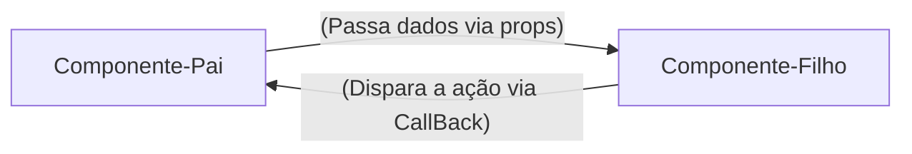
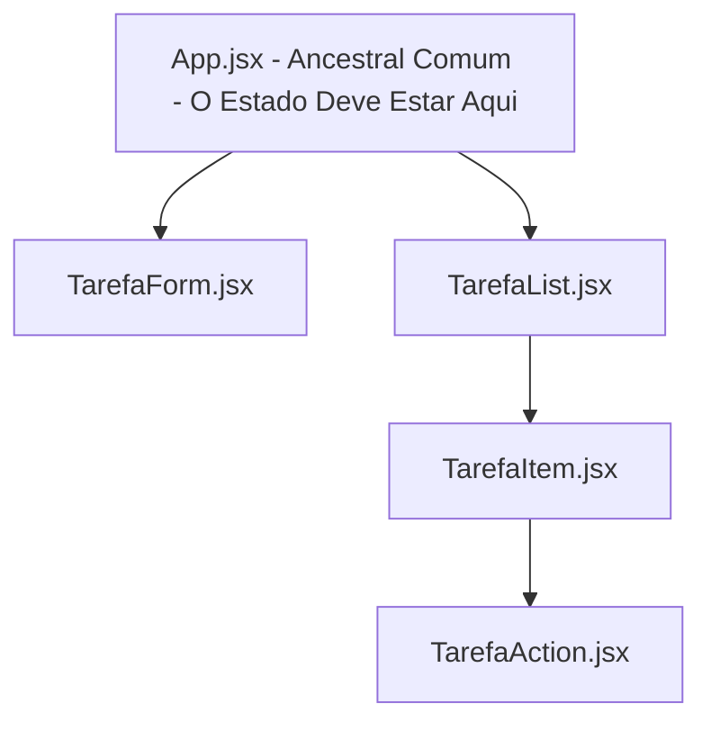

# REACT - Guia Rápido e Anotações

**Unidade Curricular:** Desenvolvimento FrontEnd
**Conteúdo:** Desenvolvimento de Frameworks - REACT

## Semana 1 - Introução ao React e Ambiente de Desenvolvimento

### 1. O que é React?

- Uma Biblioteca JavaScript para criação de interfaces de Usuário (UI)
- Funciona de forma **declarativa**: você descreve o resultado esperadpo com base nos dados, e o REACT atualiza o navegador.
- Cria *SPAs* (Single Page Applications): atualiza partes da tela sem recarregar a página inteira.

### 2. React vs JavaScript Vanilla: DOM Tradicional vs Virtual DOM

O DOM no JavaScript Tradicional é Imperativo: PRocura a tag, muda o componente e atualiza a página

React (Declarativo): UI=Componente(dados) -> Quando os dados mudam, o React atualiza o componente.

### 3. Comandos essenciais no terminal

```bash
#Criar projeto com o VITE(framework react)
npm create vite@latest nome-projeto --template react

#atualizar e instalar depêndencias do node_modules
npm install

# Iniciar o servidor local (http://localhost:5173)
npm run dev

```

### 4. Sintaxe do primeiro componente JSX(permite escrever códigos parecidos com HTML diretamente dentro do arquivo de script)

```jsx
//src/App.js
//Componente Raiz da Aplicação
function App(){
    const sistema = "Meu Site";

    return(
        <main>
            <h1>{sistema}</h1>
            <p>Gerencie seus componentes em um só lugar</p>
        </main>
    );
}

export default App;
```

> Obs: O JSX exibe **uma única tag raiz** (ou fragmento `<> ... </>`) e nomes de componentes sempre começam com a letra **Maiúscula** (UpperCamelCase).

---

## Semana 2 - JSX, componentes, Props e Eventos

### 1. Responsabilidade única (SOLID)
- Quebrar a tela em componentes pequenos. Cada componente deve fazer apenas uma única cois bem feita:

**Exemplos de componentes**:
- `Header`: cuida do título e do cabeçalho da aplicação
- `Footer`: cuida do rodape da aplicação 
- `Navbar`: cuida da barra de navegação do site

> obs: o principio do SOLID estabelece que uma unidade de software deve ter apenas um motivo para mudar

### 2. Props: passagem de dados e fluxo unidirecional

**O que são Props?**

Os props são argumentos  ou parâmetros das funções já que um componenete REACT é uma função JavaScript, ou seja, as props (abreviação de properties) permitem que o componente pai envie dados dinâmicamente para o componente filho, tornando-o customizavel e reutilizável.

### 3. Eventos e Comunicação via Callbacks

React encapsulamento de eventos nativos em objetos, a diferença do react para o HTML é a sintaxe
- no HTML: `onClick="minhaFuncao()"`
- no React JSX: `onClick={minhaFuncao}`

> funções em JavaScriot deve seguir o padrão lowerCamelCase de escrita. 



### 4. Lista dinâmicas com map() e a propriedades `key`

**Porque Arrays são estruturas padrão do FrontEnd?**

os dados chegam de banco de dados e apis no formato de coleção (json) 

o método `.map()` percorre cada item de uma array e retorna um novo componente JSX

Exemplo:

```jsx
tarefas.map((tarefa)=>(
    <TarefaItem
        key={tarefa.id}
        id={tarefa.id}
        titulo={tarefa.titulo}
        descricao={tarefa.descricao}
        completa={tarefa.completa}
    />
))
```

**Porque o React Exige o `key` no uso do `.map()`?**

o React quando renderiza uma lista precisa saber de forma inequívoca qual item específico foi adicionado, alterado ou removido. Se a chave for omitida, o react emite um aviso no console: `Warning: Each child in a list should have a unique "key" prop.`

> evitar o índice do array como chave `(key={index})`: índice do vetor não é fixo, use sempre uma chave única para os item da lista ( carimbo de data e hora, id único, )

### Componentes de Formulário Estático:

Criando o Arquivo `TarefaForm.jsx`

---

## Semana 3 - Estado Formulário e CRUD em Memória

**Tema**: Transição de uma interface estática para uma aplicação reativa, trabalho com o hook fundamental `useState`, construção de formulários com validação, Crud completo, filtros e buscas textuais.

**Contextulização**: Na semana 2, descomposição de tela monolítica em componentes reutilzizáveis, organização de fluxo dos props e captura de eventos.

### Bloco 1 - O Conceito de Estado e o Hook `useState`

**Variável Comum vs. Estado Reativo**

```js
// variável comum do JS
function Contador() {
    let contador = 0;

    function incremento() {
        contador += 1;
        console.log("Contador no console", contador); // exibe o número
    }

    return (
        <div>
            <p>Clique: {contador}</p>
            <button type="button" onClick={incremento}>Somar</button>
        </div>
    )
}

```

Obs:
* JavaScript convencionais perdem suas variáveis locias o termino da execução
* O React não monitora variáveis comuns. Ele não sabe que a variável mudou e, portanto, não tem motivo para redesenhar a tela
* O estado (state) é a memoria do componente. Quando o estado é modificado por uma função, o React agenda ua nova execução da função do componente (re-renderização), atualizando o Virtual DOM e o navegador.

**A Sintaxe do `useState`**

ao invés do `let contador =0;`

Usa-se:

```jsx
const [contador, setContador] = useState(0);
```
Obs:
* `contador`: a foto do dado no momento da renderização atual;
* `setContador`: a função despachante que atualiza o dado e notifica o React;
* `useState(0)`: define o valor com o qual o componente nasce.

**Chamando a Mudnaça de Estado**

o próximo valor sempre depende do valor anterior 

```jsx
// Forma segura e profissional de realizar a mudança de estado 
setContador((prevContador) => prevContador + 1);
// atualização funcional do valor

//Outra forma - profissional
setContador(contador + 1);
```
> Fazendo a Mudança no Aplicativo de Lista de Tarefas
> React\lista-tarefas\src\App.jsx

### Bloco 2 - Elevação de Estado (Lifting State Up)

A Comunicação entre os componentes, Para que dois ou mais componentes no React compartilhem ou modifiquem dados, o estado dever ser elevado para o ancestral comum entre eles.


Obs:
1. O Estado `tarefas`reside no App.jsx
2. O App.jsx cria as funções de modificação (handleAddTarefa, handleMudarTarefa, handleDeletarTarefa);
3. Os dados descem como props para quem precisa usá-los
4. As funções descem como callbacks para quem precisa disparar a ação;

### Bloco 3 - Formulários Controlados e Validação

No HTML tradicional, os inputs guardam seu próprio texto internamente no DOM. No React, a única fonte de aramazenamento deve ser o próprio React.

Um input é controlado quando:
1. Seu atributo `value` está amarrado a um estado do React.
2. Seu Evento `onChange` atualiza esse mesmo estado a cada caracter digitado.

Exemplo de uso:
```jsx
const [titulo, setTitulo] = useState("");

<input
    type="text"
    value="titulo"
    onChange={(e) => setTitulo(e.target.value)}
/>
```

**Prevenindo o Recarregamento com `event.preventDefault()`**

evitar o comportamento nativo da web, que é subtemer fomrulários re recarregar a página quando formulário ou eventos forem enviados.

```jsx
function handleSubmit(event){
    event.preventDefault(); //impede o carregamento da página
    //processamento dos dados
}
```

### Bloco 4 - Operações CRUD na Memória

**Operações de Imutabilidade no REACT**

* **Inserir**:

    `[novoItem, ...array]`
    // a mudança é feita criando um novo array com o novo item e espalhando os itens antigos

* **Remover**:

    `array.filter(item => item.id !== id)`
    // a mudança é feita criando um novo array filtrando os itens antigos e removendo o item desejado

* **Atualizar**:

    `array.map(item => item.id === id ? {...item, completed: true} : item)`
    // a mudança é feita criando um novo array mapeando os itens antigos e atualizando o item desejado
    

**Adicionando as 4 operações do CRUD no App.jsx**
React\lista-tarefas\src\App.jsx

---

### Bloco 5 - Filtros e Buscas

**Erro de criar estados duplicados**

Muitos programadores pensam em duplicar listas no React, porém, isso é um erro. Se você apaga uma tarefa em uma lista  deve lembrar de apagar na outra também, se esquecer de fazer isso os dados ficam desincronizados e podem gerar problemas no código.

Para resolver esse problemas, se um dado pode ser calculado a partir de um estado já existente, usse esse calculo ou essa lógica. **Não crie um novo estado para ele, ou seja, não duplique!!!**

**Vamos Criar um Componente par filtragem das Tarefas em nossa aplicação.
Digite o Comando no Terminal
```bash
type nul > src/components/TarefaFilters.jsx
```